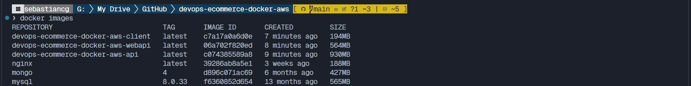
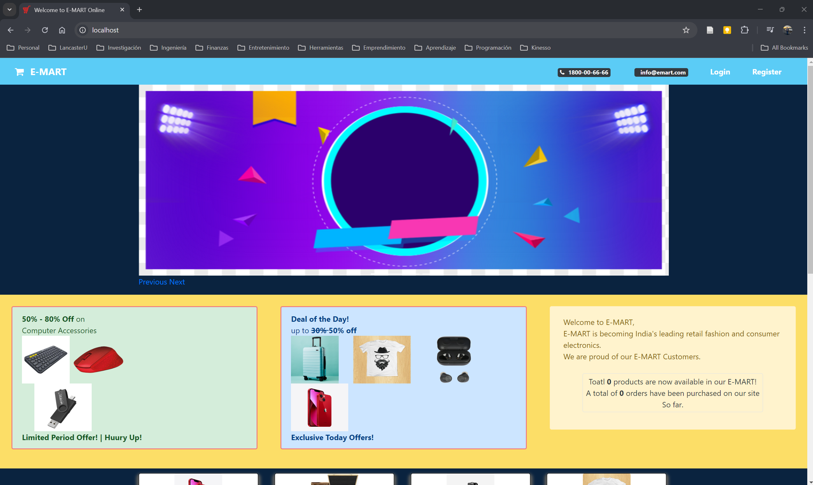

# Containerising an E-Commerce Microservice App using Docker in AWS

This project shows how to containerise and deploy an E-Commerce application,
EMart, which was developed by [devopshydclub](https://github.com/devopshydclub/emartapp) and designed as a **microservice** application.
The application is deployed in a **AWS App Runner** service.

The application contains the following services:

Image by [Joshua Adeyemi](https://medium.com/@adeyemijoshua/deploying-the-emart-microservice-application-with-docker-7eabc08bf7d7)

* **API Gateway - Nginx**: Front-end that receives all the requests and 
allows communication between the services. Requests are redirected based
on the routes:

* (`/`) **Client - Angular**: Front-End that loads the pages of the
website.

* (`/api`) **Emart API - NodeJS**: Service API that uses MongoDB (NoSQL)
database.

* (`/webapi`) **Books API - Java**: Java application that uses MySQL 
database.

## General Steps

1. Find the correct base image according to the app services 

2. Fetch the source code from GitHub (Local)

3. Write custom `Dockerfile` and `docker-compose.yml` file 

4. Run the containers to test the containerisation is correct (Local)

5. Set up the AWS App Runner service using the AWS Toolkit for VSCode

6. Deploy and validate the application in AWS App Runner service

## Project Scaffold

* Main project directory:

    - Client directory:

        * Angular source code

        * `Dockerfile` for client microservice

    - Node API directory:

        * Nodejs source code

        * `Dockerfile` for Node API microservice

    - Java API directory:

        * Java source code

        * `Dockerfile` for Java API microservice

    - Nginx directory:

        * Nginx configuration files

    - `docker-compose.yml` file

    - `README.md` file

## Find the Base Image for Microservices

* Angular - Client:

    - 1st stage:     

        * Image: https://hub.docker.com/_/node (tag: 14)

        * Builds Angular/Client web using `npm install` and 
        `npm run build --prod`

    - 2nd stage:
        
        * Image: https://hub.docker.com/_/nginx (tag: latest)

        * Copies the Angular artifact in Nginx hosting directory:
        `/usr/share/nginx/html`

        * Copies Nginx configuration file (`.conf`) in 
        `/etc/nginx/conf.d/default.conf`
        
        * Expose port: 4200

    - Depends on Node API & Java API

* Node - Emart API:

    - 1st stage:     

        * Image: https://hub.docker.com/_/node (tag: 14)

        * Builds Node API using `npm install`

    - 2nd stage:
        
        * Image: https://hub.docker.com/_/node (tag: 14)

        * Copies the Node API build in `/usr/src/app/`
        
        * Expose port: 5000

        * Run the API using the command 
        `/bin/sh -c cd /usr/src/app/ && npm start`

    - Depends on Nginx & MongoDB

    - Enable `restart` in docker-compose

* Java API:

    - 1st stage:

        * Image: https://hub.docker.com/_/openjdk (tag: 8)

        * Builds the Java API using `mvn install -DskipTests`

    - 2nd stage:

        * Image: https://hub.docker.com/_/openjdk (tag: 8)

        * Copies the Java artifact `.jar` in `/usr/src/app/`

        * Expose port: 9000

        * Run Java API using entrypoint 'java -jar book-work-0.0.1.jar'

    - Depends on MySQL DB
    
    - Enable `restart` in docker-compose

* Nginx - API Gateway:

    - Image: https://hub.docker.com/_/nginx (tag: latest)

    - We attach the `default.conf` configuration file as a volume in 
    the `docker-compose.yml` file

    - Configuration file includes the routing rules to access the 
    microservices

    - Port: 80

    - Enable `restart` in docker-compose

* MongoDB - Node API DB:

    - Image: https://hub.docker.com/_/mongo (tag: 4)

    - Set environment variable `MONGO_INITDB_DATABASE=epoc`

    - Port: 27017

* MySQL - Java API DB:

    - Image: https://hub.docker.com/_/mysql (tag: 8.0.33)

    - Set environment variables `MYSQL_ROOT_PASSWORD=emartdbpass` and
    `MYSQL_DATABASE=books`

    - Port: 3306

## Fetch the Application Source Code

* Add SSH keys to connect with GitHub

* Run `git clone git@github.com:devopshydclub/emartapp.git`

## Containerise and Build Microservices (Local)

* Write custom `Dockerfile` for each of the services: client, javaapi and nodeapi,
following the requirements in the previous section

* Write `docker-compose.yml` file to integrate the microservices and run the application

* Run `docker compose build` and `docker compose up -d` to test the application locally

    - Docker images: `docker images`

    

    - Docker containers: `docker ps`

    

    - Application in http://localhost:80/:

    

* You can test the web application:

    - User interface is Nginx-Angular container

    - Click on "Register" button, create a fake account and then log in to test
    the Node API container

    - Click on the "Try BooksMart" to test the Java API container

* Stop and remove all the local containers: `docker compose down` and 
`docker system prune -a`

* If everything is working fine, commit and push the changes to GitHub.